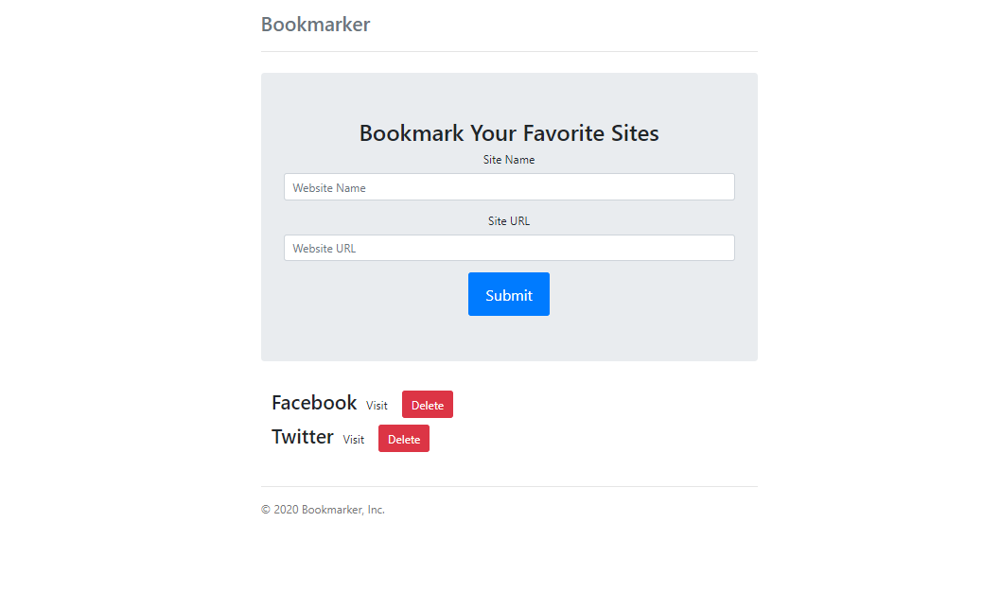

# BookMarker App

## A simple bookmarking app. This app uses no frameworks and was built using vanilla.js and bootstrap. It uses localStorage for storing bookmarks. It uses ES5 syntax and Regex.

BookMarker App: 
